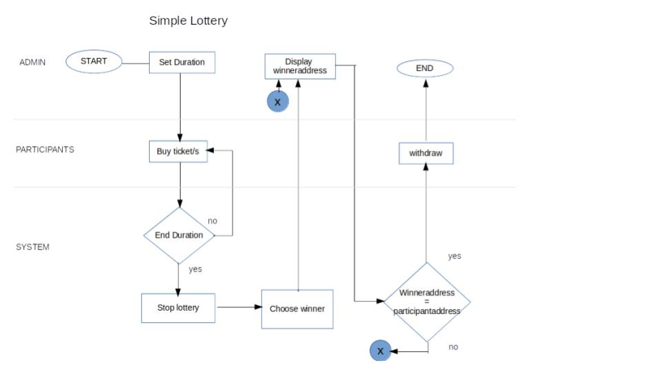
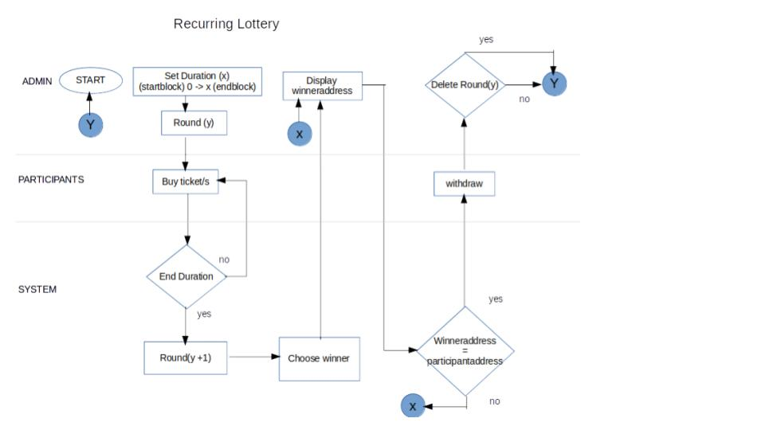
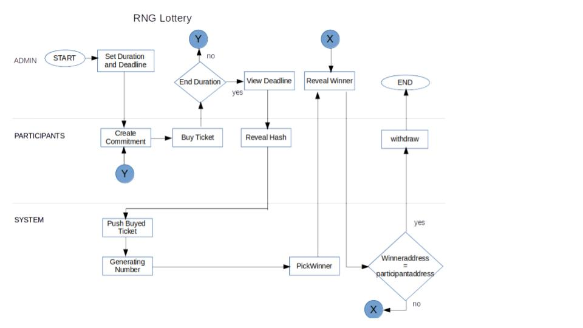
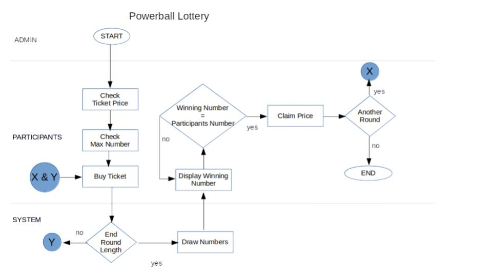

Hyperledger Lottery Game with Design Flow

## Simple Lottery

This is a short lottery game where in there is a randomly selected number upon buying a ticket.

How the Simple Lottery contract works:
* Go to the remix.ethereum.org and copy the contract.
* Copy the SimpleLottery.sol in the remix.
* Click the Run tab.
* For testing just put in the create tab 60. It means that the duration of the lottery is just 1 minute or 60 seconds.
* Click Create for running the contract.
* Ticket_PRICE is the winning price of the lottery. Click to view it. It is in wei token.
* Ticketing Closes is for the closing of the lottery.
* Put a 1 value and in ether then buy.
* You can buy tickets as long the duration is not end. It will prompt an error if the duration is ended. You can also change the address upon buying ticket.
* Click draw winner button. It is for choosing who's the winner.
* Viewing the winner wil be the winner button. It will give a address of the winner.
* Click claim for the claiming the prize.

**Design flow:**

## Recurring Lottery

It is like the simple lottery but there is a another round if the last round is ended.

How the Simple Lottery contract works:
* Go to the remix.ethereum.org and copy the contract.
* Copy the Recurring.sol in the remix.
* Click the Run tab.
* In the create tab there is a duration tab. Put it in 5. It means that the number of ticket is 5 or any duration.
* Click Create for running the contract.
* Just like the simple lottery, TICKET_PRICE button is for the ticket balance.
* Buy ticket five times with a different address. To change the address, just click the address tab and change the address.
* To check the round, click the round button.
* Afer buying tickets in 5 or any number you put in the create tab, you can actually draw the winner. Put the round number upon clicking the drawWinner button.
* If you wanted to delete the finish round, just input the round number you wanted to delete and click the deleteRound.

**Design flow:**

## RNG Lottery

RNG stands for Random Number Generated. This means that this lottery game is for a one time random number.

How the Simple Lottery contract works:
* Go to the remix.ethereum.org and copy the contract.
* Copy the RNGLottery.sol in the remix.
* Click the Run tab.
* It is the same with the recurring when it comes in the duration. It is also the participant. The reveal deadline is the turn of every participant makes. Makes the reveal duration twice than the duration.
* CreateCommit function is for the hashing the address with the corresponding the guess number. **One number only**.
Input value for CreateCommit is: **"(address)", (guess number)**.
* Copy the produce hash and paste it in the buy function. Put a ether value 1. Then click the function.
* Create again another commit by a different number and address. Paste the hash in the buy function and click it. Don't forget to put a value of 1 ether.
* Change the address into your first commit ticket. Reveal the number you put in the reveal function. Do it again in the another address.
* Click the tickets with an input of 0 or 1 to see the address you put.
* Click the reveal deadline to see the block number of the deadline. 
* Click the drawWinner function to choose who is the winner.
* Click the winner button to see what address is the winner;
* Change the address above according to what address is the winner, then click the withdraw function to claim the price.

**Design flow:**

## Powerball

Powerball is very famous lottery game in the world. It is like the 6/58 lottery game in the philippines. It is a game of guessing numbers. If the participants match the generated numbers, it will win some of the ticket price according to the numbers that match. The maximum number is one(1) to sixty-nine(69). Participants will choose only six(6) numbers.

How the Simple Lottery contract works:
* Go to the remix.ethereum.org and copy the contract.
* Copy the Powerball.sol in the remix.
* Click the Run tab.
* Click the create tab. 
* Buy tickets in this format: [[<numbers>]]. Ex: [[1,2,3,4,5,6]].
* Change the address to buy another ticket. Keep on buying the tickets until there is the error. Error occurs when the duration is in limit.
* For drawing numbers, put a value in the one(1) for the round number.
* To view the winning numbers, put a value of one in the winningNumbersfor function button. To see what is the winning numbers.
* If there is a match in your guess number, claim the prize by the function claim and put one(1) for the round.

**Design flow:**

