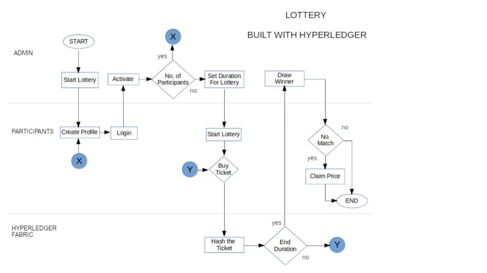
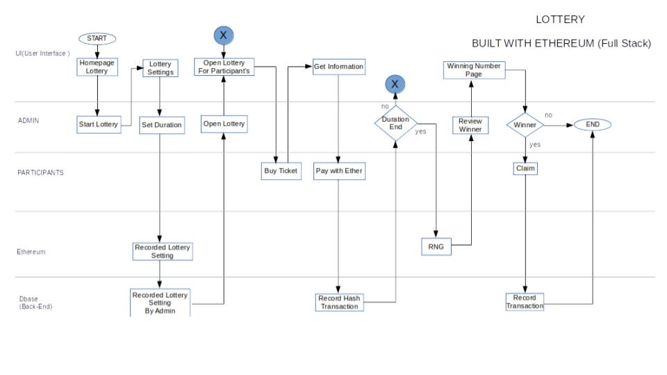
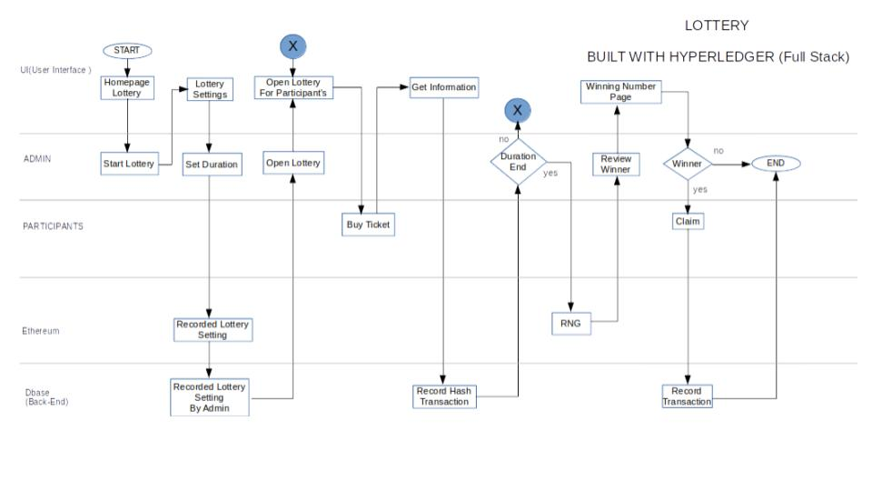

Ethereum Lottery Game with Design Flow
=========

## Simple Lottery

This is a short lottery game where in there is a randomly selected number upon buying a ticket.

**Design flow:**

## Recurring Lottery

It is like the simple lottery but there is a another round if the last round is ended.

**Design flow:**

## RNG Lottery

RNG stands for Random Number Generated. This means that this lottery game is for a one time random number.

**Design flow:**

## Powerball

Powerball is very famous lottery game in the world. It is like the 6/58 lottery game in the philippines. It is a game of guessing numbers. If the participants match the generated numbers, it will win some of the ticket price according to the numbers that match. The maximum number is one(1) to sixty-nine(69). Participants will choose only six(6) numbers.

**Design flow:**

Hyperledger TO-BE Lottery Game Design Flow
=========

**Design flow:**

Ethereum Lottery Game Fullstack Design Flow
=========

**Design flow:**

Hyperledger Lottery Game Fullstack Design Flow
=========

**Design flow:**
